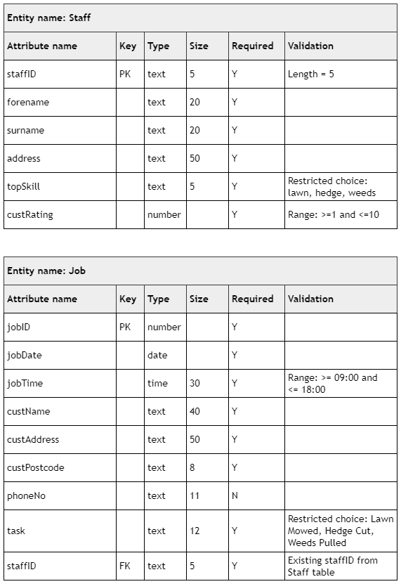

# N5 CS 2018 Task 1B

## Data dictionary

## Tasks

___1d___ Staff member DS021 has moved house recently.

Implement an SQL statement that will change the address of this member of staff to:

* 99 Willow Way, Falkirk, FA87 6FE (__2 marks__)

Print evidence of your SQL statement and the Staff table (clearly showing the new address) once the SQL statement has been implemented.